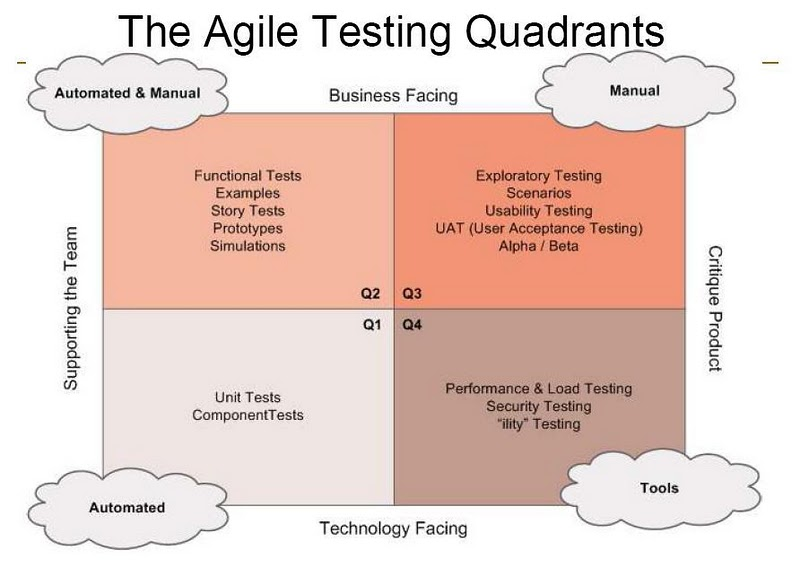
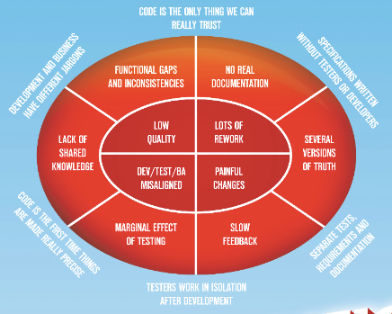
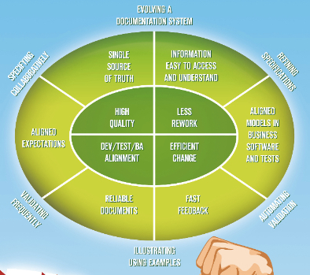

% Spécifications Exécutables
% Arnaud Bailly 
% 13/09/2011

# Introduction

# Taxonomie du test Agile : les Quadrants de Marick

# TDD, BDD

- TDD : Pratique centrale de XP, test unitaire, "Test First development"
- BDD : ["TDD done right" ?](http://codebetter.com/jeremymiller/2007/09/06/bdd-tdd-and-the-other-double-d-s/)
- Tests orientés technologie qui soutiennent l'équipe

# Tests de recette, ATDD, Tests fonctionnels
- Également une pratique centrale de XP à l'origine
- "Acceptance" : un terme galvaudé
 - ou encore "recette" qui évoque le contrat, or "collaboration over contract" !
 - confiance nécessaire
- Tests orientés métier qui soutiennent l'équipe
- "Spécification au-delà des post-its"

# Mais...

- Tester des applications de bout en bout est *difficile*
- Scripter des IHM est *à éviter*, cela a été fait pendant des
  années (ex. WinRunner) et a mené à empiler des tonnes de suites
  de tests de non-régression qui prennent des jours à s'exécuter
  et détectent très peu de bugs (ex. voir 
  [How Many Bugs Do Regression Tests Find](http://www.qanc.co.kr/4research_0402_download.htm?data_no=54&name=Brian%20Marick-How%20Many%20Bugs%20Do%20Regression%20Tests%20Find.pdf))
- Test fragiles : *Des coûts de maintenance très élevés*

# Place à la "Spécification Par l'Exemple"

- ATDD Done Right ! :-)
- Promue par Gojko Adzic et d'autres dans la communauté du Test Agile
- Peut aussi être appelée *Spécification Exécutable*, mais c'est discutable
 - Une *spécification* est elle-même un encodage du problème considéré, qui est de nature *continu* (?)
 - On ne parle ici que d'exemples, ç.à.d. un *échantillonage* de l'espace du problème/des solutions

# La Vision - Avant la Spécification par l'Exemple

# La Vision - Après la Spécification par l'Exemple

# Nous ne sommes pas seuls

> "Pour établir une pratique, les règles ne suffisent pas; on a également besoin d'exemples"

L.Wittgenstein, *De la certitude*, 1969

# Les Buts

- Spécification de "stories" par-delà le post-it
- Une "story" devrait être une opportunité de conversation, mais comment savoir quand
  nous avons fini ?
- Mais nous voulons construire un produit…

# Produit ou Projet

- Les "stories" représentent le *chemin* que nous suivons pour développer
  le logiciel : chaque "story" modifie le *produit* d'une façon spécifique
- Mais le *produit* n'est pas la somme des "stories" : il n'est pas possible
  de reconstruire la séquence exacte de "stories" implémentées étant donné
  un état particulier du produit (sauf à consulter le système de gestion de versions,
  bien sûr)
- D'où la question : faut-il garder tous ces tests que nous écrivons
  pour implémenter les "stories" ?
  
# Faire évoluer les Tests

- Un cycle de travial possible :
  1. Définir les tests de recette pour une "story" donnée avant le
     début du codage, les écrire comme ils viennent sous forme
     exécutable
  2. Une fois la "story" finie, transformer les tests en
     *exemples de spécification* : les regrouper avec l'ensemble
     des tests pour la fonctionnalité que cette "story" ajoute
     ou complète
  3. Utiliser des tests humains pour améliorer 2., ce faisant
     créant de nouvelles "stories" pour 1.. En particulier, 
     les testeurs (et les développeurs bien sûr) sont habiles à
     trouver des cas extrêmes, des chemins non couverts, des
     contradictions…

# Exécution

# Conclusion

